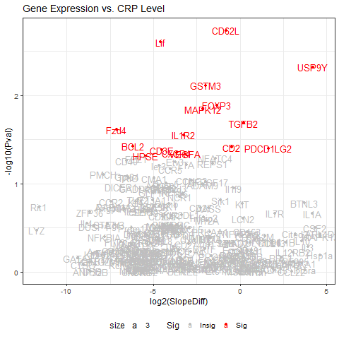
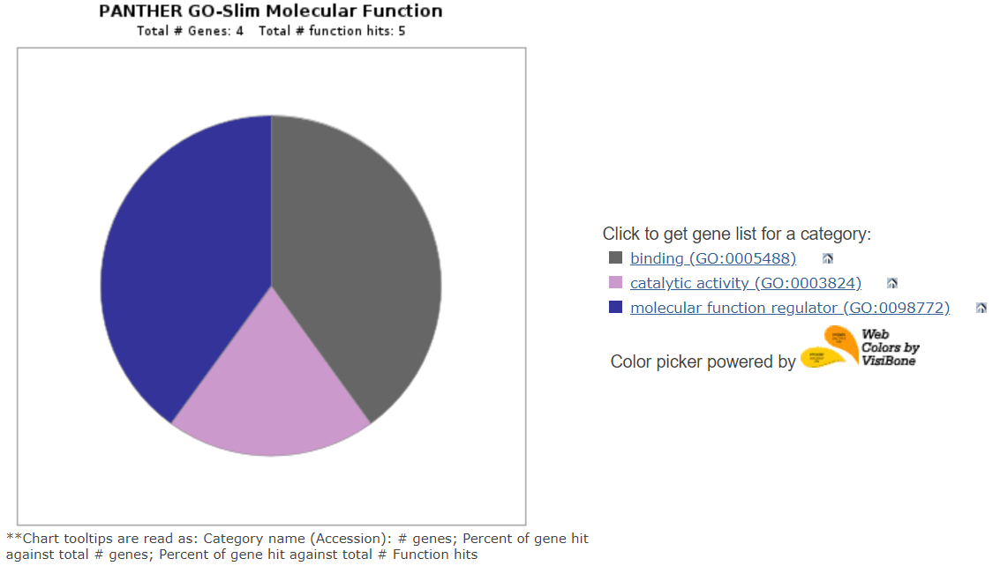

# AnalyzeCRP

([AnalyzeCRP.R](../master/scripts/AnalyzeCRP.R)) will allow you to load a comma-delimited .csv with various datapoints, perform single regressions of Body Mass Index (BMI) vs. CRP from the Complete Blood Count with Differential (CBC-D) results, produce a 2-D scatterplot for the results, and perform a one-way ANOVA with a formatted box. 

### CRP Background

*`C-reactive protein (CRP)`* is a blood test marker for inflammation in the body. *CRP* is produced in the liver and its level is measured by testing the blood. There are `no symptoms` of an elevated C-reactive protein level. The increase can be due to different causes such as: 
+ burns
+ trauma
+ infections
+ pneumonia or tuberculosis
+ heart attack
+ chronic inflammatory diseases (lupus, vasculitis, or rheumatoid arthritis) 
+ inflammatory bowel disease
+ certain cancers.

### Data transformation and Volcano Plot

These part of the project is to produce differential expression results and a corresponding volcano plot. It includes transforming data, extracting statistical results, combining rows and columns, FOR loops and IFELSE commands, and intermediate features of ggplot2.  

Source

> https://www.medicinenet.com/c-reactive_protein_test_crp/article.htm

Data (RobinsonEtAl_Sup1.csv) was downloaded from: 

> Robinson, JM. et al. 2019. Complete blood count with differential: An effective diagnostic for IBS subtype in the context of BMI? BioRxiv. doi: https://doi.org/10.1101/608208.

## Package Installation

```
1. install.packages("ggplot2")
2. library(ggplot2)

```
## Read data and column for the range of CRP parameter

```
> IBS <- read.csv("data/RobinsonEtAl_Sup1.csv", header = TRUE)
> head(IBS)
> IBS$CRP_result <- "NA"

> IBS$CRP_result[IBS$CRP > 3] <- "HIGH"

> IBS$CRP_result[IBS$CRP <= 3 & IBS$LDH >= 1] <- "NORMAL"

> IBS$CRP_result[IBS$CRP < 1] <- "LOW"

> write.csv(IBS, "data_output/output.cvs")

```
## Single regression, BMI x CRP

```
> CRP.regression <- lm(BMI ~ CRP, data=IBS)
> summary(CRP.regression)
> sink('data_output/CRP_regression.txt', append = TRUE)
> print(CRP.regression)
> sink()

```
### Results

Call:
lm(formula = BMI ~ CRP, data = IBS)

Coefficients:

  | Intercept | CRP |
  | --- | --- |
  | 25.4076 | 0.5737 |

## ANOVA: IBS-subtype vs. Bloodwork parameter (CRP)

```
> CRP.aov <- aov(CRP ~ IBS.subtype, data = IBS)
> summary(CRP.aov)
> sink('data_output/CRP_anova.txt', append = TRUE)
> print(CRP.aov)
> sink()

```
### Results

Call:
   aov(formula = CRP ~ IBS.subtype, data = IBS)

Terms:

  | Type of value | IBS.subtype | Residuals |
  | --- | --- | --- |
| Sum of Squares | 2.7264 | 1217.4178 |
| Deg. of Freedom | 1 | 107 |

Residual standard error: 3.37309
Estimated effects may be unbalanced
2 observations deleted due to missingness

## Scatterplots of CRP

```
> ggplot(IBS, aes(x=BMI, y=CRP)) +
  geom_point() +    
  geom_smooth(method=lm) 

> png("fig_output/CRP_scatterplot.png")
> CRP_scatterplot <- ggplot(IBS, aes(x = BMI, y = CRP)) +
  geom_point() +    
  geom_smooth(method = lm) 
> print(CRP_scatterplot)
> dev.off()

```
### Scatterplot Graph 


## Box plots of CRP

```
> boxplot(CRP ~ IBS.subtype, data = IBS, main="CRP by IBS subtype", 
        xlab = "IBS.subtype", ylab = "CRP",  col = c("green","yellow","purple")
)

> png("fig_output/CRP_boxplot.png")
> CRP_boxplot <- boxplot(CRP ~ IBS.subtype, data = IBS, main="CRP by IBS subtype", xlab = "IBS.subtype", ylab = "CRP", col = c("green","yellow","purple"))
> print(CRP_boxplot)
> dev.off()

```
### Box plots Graph


##

# Data transformation and Volcano Plot

## Read in the table of fold changes

```
FCdata <- read.csv("../data/FC.csv", row.names = 1, header = FALSE)

```

## Read in the table of expression data

```
IBS <- read.csv("../data/GXdata.csv", header = TRUE)

```

## Access only the columns with RNA Expression (subsetting)

```
names(IBS)[28:277]

```

## Make a list of anova(lm()) results for bloodwork parameter

```
storage <- list()

for(i in names(IBS)[28:277]){
  storage[[i]]  <- anova(lm(get(i) ~ CRP, IBS))
}

```

## Extract the p-values into a new list

```
pVals <- list()

for(i in names(storage)){
  pVals[[i]] <- -(log10(storage[[i]]$'Pr(>F)'))
}

```

## Convert the pValues list into a data frame. 

```
DFpvalues <- data.frame(matrix(unlist(pVals), nrow=length(pVals), byrow=T))

```

## Combine the results dataframes and write column labels

```
VolcanoPlotData <- cbind(FCdata, DFpvalues)
names(VolcanoPlotData)[1] <- paste("log2(SlopeDiff)")
names(VolcanoPlotData)[2] <- paste("-log10(Pval)")

```

## Add a column to evaluate significance

```
VolcanoPlotData$Sig <- ifelse(VolcanoPlotData$`-log10(Pval)` > 1.3, "Sig", "Insig");

```
  
## Make a volcano-style scatterplot for these results
install.packages("ggplot2")
library(ggplot2)

## library(ggrepel)

```
png("../fig_output/CRPplot.png")
CRPplot <- ggplot(VolcanoPlotData, aes(x = `log2(SlopeDiff)`, y = `-log10(Pval)`, label=rownames(VolcanoPlotData), color=Sig)) +
  geom_point(aes(color = Sig)) +
  scale_color_manual(values = c("grey", "red")) +
  theme_bw(base_size = 12) + theme(legend.position = "bottom") +
  geom_text(aes(x = `log2(SlopeDiff)`,y = `-log10(Pval)`, fontface = 1, size=3,  label=row.names(VolcanoPlotData)))

print(CRPplot + ggtitle("Gene Expression vs. CRP Level"))
dev.off()

```

### Volcano plots Graph



##

### Significant genes for CRP

 | Abbreviation of the name | Complete Name |
  | --- | --- |
| USP9Y | ubiquitin specific peptidase 9 Y-linked |
| VEGFA | vascular endothelial growth factor A |
| PDCD1LG2 | Programmed cell death 1 ligand 2 |
| TGFB2 | transforming growth factor beta 2 |

### Panther Analysis Result



##


