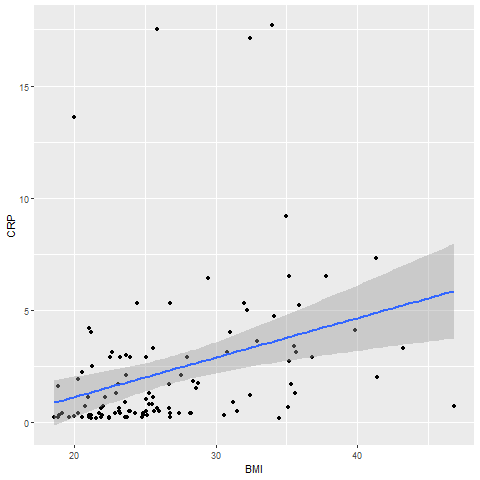
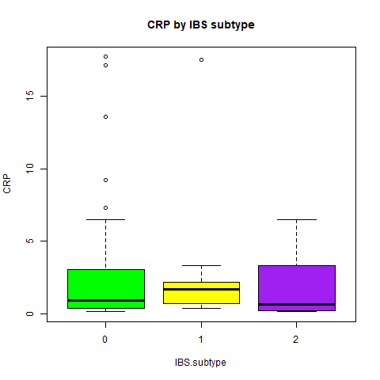

## AnalyzeCRP
([AnalyzeBloodwork.R](../master/AnalyzeBloodwork.R)) will allow you to load a comma-delimited .csv with various datapoints, perform single regressions of Body Mass Index (BMI) vs. CRP from the Complete Blood Count with Differential (CBC-D) results, produce a 2-D scatterplot for the results, and perform a one-way ANOVA with a formatted box. 

C-reactive protein (CRP) is a blood test marker for inflammation in the body. CRP is produced in the liver and its level is measured by testing the blood. There are no symptoms of an elevated C-reactive protein level. The increase can be due to different causes as burns,
trauma, infections, such as pneumonia or tuberculosis, heart attack, chronic inflammatory diseases such as lupus, vasculitis, or rheumatoid arthritis, inflammatory bowel disease, and certain cancers.

Data (RobinsonEtAl_Sup1.csv) was downloaded from: 

Robinson, JM. et al. 2019. Complete blood count with differential: An effective diagnostic for IBS subtype in the context of BMI? BioRxiv. doi: https://doi.org/10.1101/608208.

## Installation of packages 
```
install.packages("ggplot2")
library(ggplot2)

```
## Read data and column for the range of CRP parameter
```
> IBS <- read.csv("data/RobinsonEtAl_Sup1.csv", header = TRUE)
> head(IBS)
> IBS$CRP_result <- "NA"

> IBS$CRP_result[IBS$CRP > 3] <- "HIGH"

> IBS$CRP_result[IBS$CRP <= 3 & IBS$LDH >= 1] <- "NORMAL"

> IBS$CRP_result[IBS$CRP < 1] <- "LOW"

> write.csv(IBS, "data_output/output.cvs")

```

### Single regression, BMI x CRP with results
```
> CRP.regression <- lm(BMI ~ CRP, data=IBS)
> summary(CRP.regression)
> sink('data_output/CRP_regression.txt', append = TRUE)
> print(CRP.regression)
> sink()

Call:
lm(formula = BMI ~ CRP, data = IBS)

Coefficients:
 (Intercept)          CRP  
    25.4076       0.5737  

```
### ANOVA: IBS-subtype vs. Bloodwork parameter (CRP) and results
```
> CRP.aov <- aov(CRP ~ IBS.subtype, data = IBS)
> summary(CRP.aov)
> sink('data_output/CRP_anova.txt', append = TRUE)
> print(CRP.aov)
> sink()

Call:
   aov(formula = CRP ~ IBS.subtype, data = IBS)

Terms:
                IBS.subtype Residuals
Sum of Squares       2.7264 1217.4178
Deg. of Freedom           1       107

Residual standard error: 3.37309
Estimated effects may be unbalanced
2 observations deleted due to missingness

```
### Scatterplots of CRP
```
> ggplot(IBS, aes(x=BMI, y=CRP)) +
  geom_point() +    
  geom_smooth(method=lm) 

> png("fig_output/CRP_scatterplot.png")
> CRP_scatterplot <- ggplot(IBS, aes(x = BMI, y = CRP)) +
  geom_point() +    
  geom_smooth(method = lm) 
> print(CRP_scatterplot)
> dev.off()

```


### Box plots of CRP
```
> boxplot(CRP ~ IBS.subtype, data = IBS, main="CRP by IBS subtype", 
        xlab = "IBS.subtype", ylab = "CRP",  col = c("green","yellow","purple")
)

> png("fig_output/CRP_boxplot.png")
> CRP_boxplot <- boxplot(CRP ~ IBS.subtype, data = IBS, main="CRP by IBS subtype", xlab = "IBS.subtype", ylab = "CRP", col = c("green","yellow","purple"))
> print(CRP_boxplot)
> dev.off()

```

##
